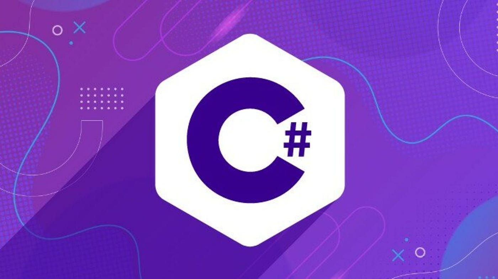

# Back-End Development

## Subject Code

HTTP-5125-RNB

## Description

This repository includes files, folders, and exercises related to the subject of **Back-End Development**. It features a significant amount of C# code.

## Code Editors

- [VS Code](https://code.visualstudio.com/)
- [VS](https://visualstudio.microsoft.com/)

> C# (pronunced as C Sharp) programming language is utilized in the subject.

## Sample Code

```C#
/* The below code sums the given two mumbers */
int number1 = 5;
int number2 = 10;
Console.WriteLine(number1 + number2); // prints 15 on the console
```

## Image
